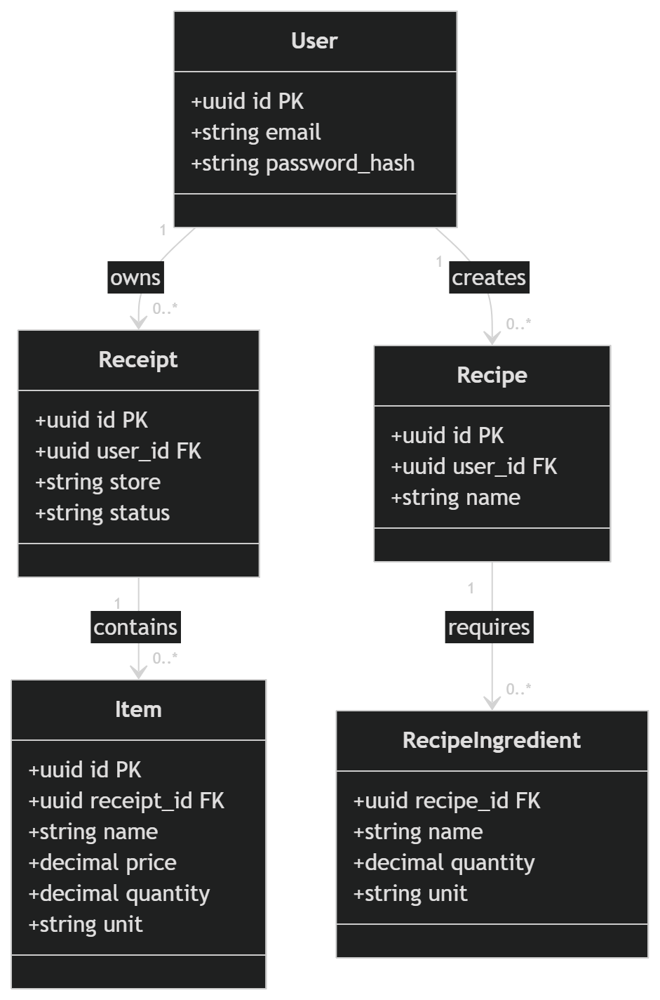

# Haul
Full-stack service for turning grocery receipts into structured inventory using AI, with meal suggestions based on available ingredients.

# Stack
- Go
- Vite
- React
- PostgreSQL
- Redis (Planned)
- Gemini API

# Status 
Done: REST Api routes set up

Done: image upload in demo ui -> formatted json receipt data (locally ran)

Done: Database schema has been completed, with a join table for recipe ingredients since a single ingredient could belong to multiple different recipes. DB design is shown below in a diagram

In progress: Currently working on setting up auth + saving receipts to database

# Roadmap
- Receipt image upload + AI parsing (async)
- User accounts (bcrypt)
- Groccery inventory + meal recommendations
- Reduce costs by replacing Gemini API with OCR + lightweight LLM

# DB Schema

