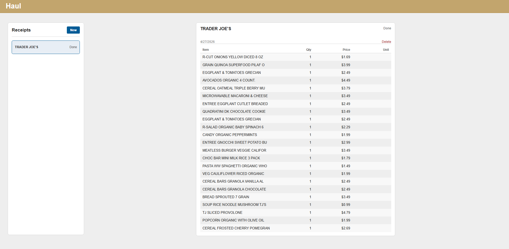

# Haul

Haul is a full-stack app for turning grocery receipts into structured inventory using AI, with planned meal suggestions based on available ingredients. Deployment on Vercel is planned.

## Preview

## Stack

- Go
- React
- Vite
- PostgreSQL
- Gemini API
- Redis planned

## Status

### Done

- Built RESTful API routes with Go and chi
- Receipt image upload from frontend
- AI receipt parsing into structured JSON
- PostgreSQL schema completed
- Recipe ingredient join table designed for many-to-many recipe/ingredient relationships
- User registration and login
- Password hashing with bcrypt
- JWT-based authentication with backend route middleware
- Frontend protected routes for authenticated pages
- Saving and retrieving receipts by authenticated user ID
- Receipt dashboard with per-user receipt list and selectable receipt detail view
- Receipt deletion for authenticated users
- Styled login and register pages
- Navbar user menu with logout
- Receipt upload loading state and basic upload error handling

### In Progress

- Completing remaining REST API handlers
- Receipt editing/update flow
- Additional production security measures
- Deployment setup

## Roadmap

- Receipt editing and update support
- Dockerized background worker for async receipt image parsing
- Redis-backed job queue for receipt processing
- Grocery inventory tracking
- Meal recommendations based on available ingredients
- Cost reduction by replacing Gemini API with OCR + lightweight LLM
- Deploy app

## Database Schema

